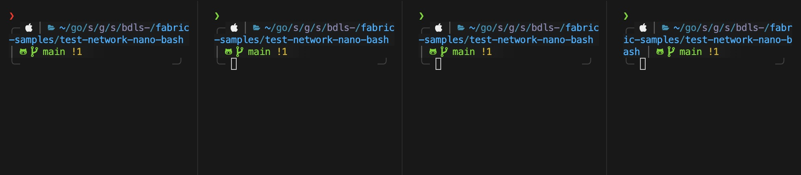
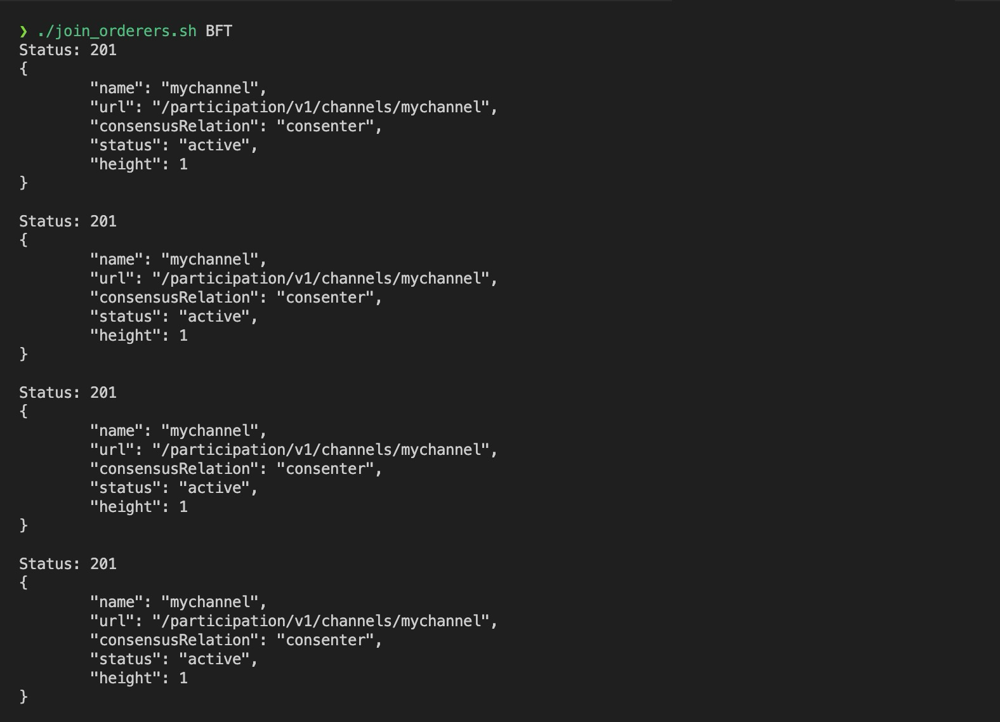

# Running Fabric with BDLS with test-network-nano-bash
This is a guide to run Fabric with BDLS configured orderer using fabric-samples/`test-network-nano-bash`. 

## Prerequisites
Follow these guides to install prerequisites for running fabric on your machine. You might not need docker installed as we won't run test-network with docker. 
- [Prerequisites](https://hyperledger-fabric.readthedocs.io/en/release-2.5/prereqs.html)
- [Setting up dev environment](https://hyperledger-fabric.readthedocs.io/en/latest/dev-setup/devenv.html)

## Getting Started
1. A working directory is required - for example, Go Developers use the $HOME/go/src/github.com/<your_github_userid> directory.  This is a Golang Community recommendation for Go projects. Create and change directory to `fabric-bdls` where we will work throughout this guide. 

2. Get `fabric-samples` install script which we will use to clone latest `fabric-samples`, fabric binaries and configuration files. 

```shell
curl -sSLO https://raw.githubusercontent.com/hyperledger/fabric/main/scripts/install-fabric.sh && chmod +x install-fabric.sh
```

2. Run this install script to get latest `fabric-samples` repository, fabric binaries in `fabric-samples/bin` and configuration files in `fabric-samples/config`

```shell
./install-fabric.sh samples binary
```

3. Change directory to `fabric-samples`. Edit the `externalBuilders` option inside `fabric-samples/config/configtx.yaml` file because of [this](https://github.com/hyperledger/fabric-samples/tree/main/test-network-nano-bash#to-run-the-chaincode-as-a-service).

```shell
yq -i 'del(.chaincode.externalBuilders) | .chaincode.externalBuilders[0].name = "ccaas_builder" | .chaincode.externalBuilders[0].path = env(PWD) + "/builders/ccaas" | .chaincode.externalBuilders[0].propagateEnvironment[0] = "CHAINCODE_AS_A_SERVICE_BUILDER_CONFIG"' config/core.yaml
```

4. Also it is recommended to run configure external builders to run chaincode without docker. Here is [why](https://github.com/hyperledger/fabric-samples/tree/main/test-network-nano-bash#run-the-chaincode-without-docker)!
```
5. Change directory to `bdls-fabric` and clone `hyperledger-labs/bdls` renamed as `fabric`. 
```shell
git clone https://github.com/hyperledger-labs/bdls fabric
```

6. Change directory to `fabric-bdls/fabric` and make sure you're on `BDLS-RAFT-TPS-readyc` branch. Now we will make new fabric binaries including `orderer` which incorporates BDLS protocol as BFT consensus protocol. Run following commands inside `fabric-bdls/fabric` repository. 
```shell
make configtxlator configtxgen cryptogen orderer osnadmin peer discover ledgerutil                 
```

7. Change directory to `fabric-bdls/fabric-samples`. Comment out line 189-284 containing the `kafka` related configuration from `fabric-samples/config/orderer.yaml`. Also set `FABRIC_CFG_PATH` environment variable so that orderer can read the required configuration correctly. 

```shell
export FABRIC_CFG_PATH=`${PWD}/../config`
```

8. Edit the `fabric-samples/test-network-nano-bash/bft-config/configtx.yaml` file to re-configure the orderer parameters for BDLS. Use following values: 
```yaml
Orderer: &OrdererDefaults
  # Batch Timeout: The amount of time to wait before creating a batch
  BatchTimeout: 2s
  # Batch Size: Controls the number of messages batched into a block
  BatchSize:
    # Max Message Count: The maximum number of messages to permit in a batch
    MaxMessageCount: 500
    # Absolute Max Bytes: The absolute maximum number of bytes allowed for
    # the serialized messages in a batch.
    AbsoluteMaxBytes: 10 MB
    # Preferred Max Bytes: The preferred maximum number of bytes allowed for
    # the serialized messages in a batch. A message larger than the preferred
    # max bytes will result in a batch larger than preferred max bytes.
    PreferredMaxBytes: 2 MB
```

## Starting the network 

9. Now that we've configured both the `fabric-bdls/fabric` and `fabric-bdls/fabric-samples` repository, we are ready to start the orderers. Change directory to `fabric-bdls/fabric-samples/test-network-nano-bash` and split the terminal window into 4. Make sure all the terminals are inside the `fabric-samples/test-network-nano-bash` directory



10. In the first orderer terminal, run `./generate_artifacts.sh BFT` to generate crypto material (calls cryptogen) and application channel genesis block and configuration transactions (calls configtxgen) for BFT configured orderer. The artifacts will be created in the crypto-config and channel-artifacts directories. 

11. Now in each of the orderer terminal windows run ./orderer1.sh, ./orderer2.sh, ./orderer3.sh, ./orderer4.sh respectively.

12. Open a different terminal inside `test-network-nano-bash` and run `./join_orderers.sh BFT`. You should see something like this. 


The orderer terminal windows will not change for intentional sleep duration of 8s after which you will start seeing logs indicating creation of blocks with test transactions and finally after all the 200 blocks are created you will also see the final TPS value for this integration where `in-flight` blocks is 1. 

